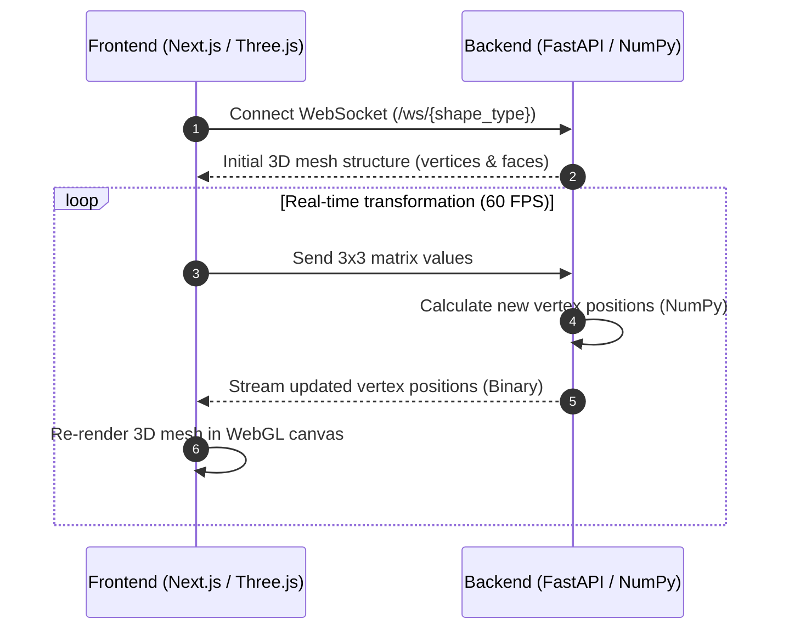

# LinAlgMadeEasy

**LinAlgMadeEasy** is an interactive, real-time 3D linear algebra visualiser. It lets you experiment with 3D matrix transformations ($\mathbb{R}^3 \to \mathbb{R}^3$) on vector arrows, boxes, and spherical meshes directly in your browser.

The application combines a **FastAPI (Python)** backend for matrix mathematics with a **Next.js & Three.js** frontend for smooth WebGL rendering over high-speed WebSockets.

---

## Demo

<div align="center">
   <video src="https://github.com/user-attachments/assets/3b5b0a11-a161-43d0-bcd0-32757afe3889" controls="controls" width="100%" style="max-width: 800px; border-radius: 8px;"></video>
</div>

---

## Key Features

- **Real-Time Matrix Controls**: Adjust any value in the $3 \times 3$ transformation matrix using sliders or number inputs to observe rotations, scaling, shearing, and reflections instantly.
- **Multiple 3D Shapes**: Switch seamlessly between a basis vector arrow, a cube, and a sphere.
- **Interactive 3D Viewport**: Orbit, zoom, and pan around the scene with custom colour-coded Cartesian coordinate axes ($X$ red, $Y$ green, $Z$ blue) and dynamic tick markers.
- **Fast WebSocket Streaming**: Matrix calculations run in NumPy on the backend and stream back as compact binary data to ensure smooth 60 FPS rendering in the browser.

---

## Architecture



---

## Tech Stack

- **Frontend**: Next.js 14, React Three Fiber, Three.js, TypeScript, Tailwind CSS, Framer Motion
- **Backend**: FastAPI, Uvicorn, NumPy, PyVista
- **Communication**: WebSockets (JSON for initial setup, binary buffers for vertex streaming)

---

## Project Structure

```
LinAlgMadeEasy/
├── backend/
│   ├── api/websocket.py         # WebSocket endpoint for matrix streaming
│   ├── core/transformations.py   # Matrix transformation calculations
│   ├── geometry/generator.py     # 3D shape and mesh generation
│   ├── main.py                  # FastAPI application entry point
│   ├── requirements.txt         # Python dependencies
│   └── Dockerfile               # Backend Docker container configuration
└── frontend/
    ├── src/
    │   ├── app/page.tsx         # Main page and WebSocket connection handler
    │   ├── canvas/Scene.tsx     # 3D viewport and dynamic mesh renderer
    │   ├── canvas/Axes.tsx      # 3D Cartesian axes with dynamic markers
    │   ├── components/Controls.tsx # Matrix input controls and sliders
    │   └── components/ToolArsenal.tsx # Shape selector menu
    ├── package.json             # Frontend dependencies
    └── tsconfig.json            # TypeScript configuration
```

---

## Getting Started

### Prerequisites
- **Python 3.10+**
- **Node.js 18+** (`npm` or `pnpm`)

---

### 1. Backend Setup

1. Open a terminal and navigate to the `backend` folder:
   ```bash
   cd backend
   ```

2. Create and activate a Python virtual environment:
   - **Windows (PowerShell)**:
     ```powershell
     python -m venv .venv
     .\.venv\Scripts\Activate.ps1
     ```
   - **macOS / Linux**:
     ```bash
     python3 -m venv .venv
     source .venv/bin/activate
     ```

3. Install dependencies:
   ```bash
   pip install -r requirements.txt
   ```

4. Start the backend server:
   ```bash
   uvicorn main:app --reload --host 0.0.0.0 --port 8000
   ```
   The backend will be available at `http://localhost:8000`.

---

### 2. Frontend Setup

1. Open a new terminal and navigate to the `frontend` folder:
   ```bash
   cd frontend
   ```

2. Install dependencies:
   ```bash
   npm install
   # or
   pnpm install
   ```

3. Start the development server:
   ```bash
   npm run dev
   # or
   pnpm dev
   ```

4. Open `http://localhost:3000` in your web browser.

---

### Running with Docker (Backend)

You can also run the backend service in a container:

```bash
docker build -t linalg-backend backend/
docker run -d -p 8000:8000 --name linalg-backend-container linalg-backend
```
