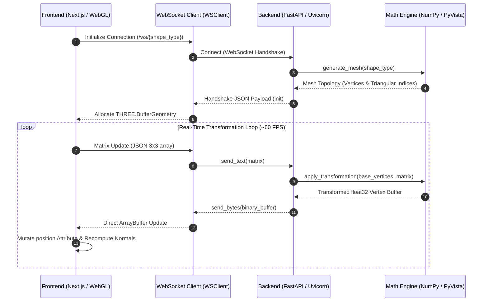

# LinAlgMadeEasy

LinAlgMadeEasy is a high-performance, real-time 3D linear algebra visualiser and matrix transformation engine. The application provides an interactive WebGL interface for observing linear transformations $\mathbb{R}^3 \to \mathbb{R}^3$ applied to 3D vector arrows and parametric surface meshes in real time.

The system utilises a decoupled client-server architecture:
- **Computational Backend**: Asynchronous FastAPI service leveraging PyVista and vectorised NumPy routines for high-speed matrix-vector transformations.
- **Client Frontend**: WebGL-accelerated Next.js application built with Three.js, React Three Fiber, Framer Motion, and TailwindCSS.
- **Communication Protocol**: Full-duplex WebSocket connection utilising JSON for initial mesh topology negotiation and raw binary floating-point buffers (`Float32Array`) for low-latency vertex coordinate updates.

---

## Architectural Overview



---

## Technical Specifications & Features

### 1. Low-Latency Binary Streaming Protocol
To bypass JSON serialisation overhead during high-frequency interactive slider updates, the system employs a hybrid transport layer implemented in [websocket.py](file:///C:/Users/HP/OneDrive/Documents/GitHub/LinAlgMadeEasy/backend/api/websocket.py) and [websocket.ts](file:///C:/Users/HP/OneDrive/Documents/GitHub/LinAlgMadeEasy/frontend/src/lib/websocket.ts#L1-L44):
- **Initialisation Handshake**: Mesh vertex positions $V_0 \in \mathbb{R}^{N \times 3}$ and index topology arrays $I \in \mathbb{Z}^{M}$ are transmitted as structured JSON.
- **Vertex Streaming**: Transformed coordinates are packed into raw IEEE 754 single-precision float binary buffers using Python `struct.pack()` and delivered directly into WebGL `Float32Array` buffers without text parsing.

### 2. Vectorised Linear Transformation Engine
Matrix operations are vectorised via NumPy in [transformations.py](file:///C:/Users/HP/OneDrive/Documents/GitHub/LinAlgMadeEasy/backend/core/transformations.py#L3-L21) ([`apply_transformation`](file:///C:/Users/HP/OneDrive/Documents/GitHub/LinAlgMadeEasy/backend/core/transformations.py#L3-L21)):
Given a set of $N$ 3D vertex coordinates represented as matrix $V \in \mathbb{R}^{N \times 3}$ and a transformation matrix $M \in \mathbb{R}^{3 \times 3}$, the transformed vertices $V_{\text{trans}}$ are computed in a single BLAS matrix-matrix multiplication:
$$V_{\text{trans}} = V \cdot M^T$$

### 3. Parametric Surface & Vector Mesh Synthesis
Surface meshes and vector representations are synthesised dynamically using PyVista (VTK) in [generator.py](file:///C:/Users/HP/OneDrive/Documents/GitHub/LinAlgMadeEasy/backend/geometry/generator.py#L6-L35) ([`generate_mesh`](file:///C:/Users/HP/OneDrive/Documents/GitHub/LinAlgMadeEasy/backend/geometry/generator.py#L6-L35)):
- **Vector Arrow**: Synthesised via `pv.Arrow` for visualising vector space basis manipulation.
- **Box Mesh**: Triangulated cube geometry generated via `pv.Box(level=10)`.
- **Sphere Mesh**: Parametric spherical surface mesh generated via `pv.Sphere(radius=1.0, theta_resolution=30, phi_resolution=30)`.

### 4. Reactive WebGL Canvas & Buffer Mutation
The frontend rendering system in [Scene.tsx](file:///C:/Users/HP/OneDrive/Documents/GitHub/LinAlgMadeEasy/frontend/src/canvas/Scene.tsx#L15-L65) ([`DynamicMesh`](file:///C:/Users/HP/OneDrive/Documents/GitHub/LinAlgMadeEasy/frontend/src/canvas/Scene.tsx#L15-L65)) updates Three.js `THREE.BufferGeometry` attributes in-place upon receiving binary frames:
- Direct mutation of `geometryRef.current.attributes.position`.
- Dynamic recalculation of vertex lighting normals via `computeVertexNormals()`.
- Synchronised rendering with custom 3D Cartesian coordinate axes in [Axes.tsx](file:///C:/Users/HP/OneDrive/Documents/GitHub/LinAlgMadeEasy/frontend/src/canvas/Axes.tsx#L33-L234) ([`Axes`](file:///C:/Users/HP/OneDrive/Documents/GitHub/LinAlgMadeEasy/frontend/src/canvas/Axes.tsx#L33-L234)), incorporating dynamic tick markers scaled relative to camera zoom.

### 5. Client State Throttling
Matrix input changes in [Controls.tsx](file:///C:/Users/HP/OneDrive/Documents/GitHub/LinAlgMadeEasy/frontend/src/components/Controls.tsx#L4-L20) ([`useThrottle`](file:///C:/Users/HP/OneDrive/Documents/GitHub/LinAlgMadeEasy/frontend/src/components/Controls.tsx#L4-L20)) are throttled to a target update period of ~16ms (60 FPS) to prevent WebSocket buffer saturation during continuous slider dragging.

---

## Directory Structure

```
LinAlgMadeEasy/
├── backend/
│   ├── api/
│   │   └── websocket.py         # WebSocket connection manager & stream endpoint
│   ├── core/
│   │   └── transformations.py   # Vectorised NumPy matrix multiplication kernel
│   ├── geometry/
│   │   └── generator.py         # PyVista mesh synthesis & triangulation engine
│   ├── Dockerfile               # Container setup with GL library dependencies
│   ├── main.py                  # FastAPI application entry point & CORS configuration
│   ├── requirements.txt         # Python package manifest
│   └── test_math.py             # Integration test suite for transformation routines
└── frontend/
    ├── src/
    │   ├── app/
    │   │   ├── layout.tsx       # Root layout definition
    │   │   └── page.tsx         # Main application container & WebSocket state loop
    │   ├── canvas/
    │   │   ├── Axes.tsx         # Custom 3D coordinate system with tick markers
    │   │   └── Scene.tsx        # React Three Fiber canvas & BufferGeometry renderer
    │   ├── components/
    │   │   ├── Controls.tsx     # Matrix input panel & throttle hook
    │   │   └── ToolArsenal.tsx # Floating action tool menu (Framer Motion)
    │   └── lib/
    │       └── websocket.ts     # Binary WebSocket client abstraction
    ├── package.json             # Node.js dependencies & execution scripts
    └── tsconfig.json            # TypeScript configuration
```

---

## Source Code Reference

| Component / Function | File Path | Description |
| :--- | :--- | :--- |
| [main.py](file:///C:/Users/HP/OneDrive/Documents/GitHub/LinAlgMadeEasy/backend/main.py) | `backend/main.py` | Initialises FastAPI application and CORS middleware. |
| [websocket_endpoint](file:///C:/Users/HP/OneDrive/Documents/GitHub/LinAlgMadeEasy/backend/api/websocket.py#L23-L56) | `backend/api/websocket.py` | Handles WebSocket connections, mesh handshake, and binary buffer output. |
| [apply_transformation](file:///C:/Users/HP/OneDrive/Documents/GitHub/LinAlgMadeEasy/backend/core/transformations.py#L3-L21) | `backend/core/transformations.py` | Performs batch vector transformation $V_{\text{trans}} = V \cdot M^T$. |
| [generate_mesh](file:///C:/Users/HP/OneDrive/Documents/GitHub/LinAlgMadeEasy/backend/geometry/generator.py#L6-L35) | `backend/geometry/generator.py` | Generates triangulated 3D mesh arrays using PyVista. |
| [run_tests](file:///C:/Users/HP/OneDrive/Documents/GitHub/LinAlgMadeEasy/backend/test_math.py#L4-L47) | `backend/test_math.py` | Verification suite for mesh generation and array transformations. |
| [Home](file:///C:/Users/HP/OneDrive/Documents/GitHub/LinAlgMadeEasy/frontend/src/app/page.tsx#L9-L61) | `frontend/src/app/page.tsx` | Next.js root page coordinating client lifecycle and state. |
| [Scene](file:///C:/Users/HP/OneDrive/Documents/GitHub/LinAlgMadeEasy/frontend/src/canvas/Scene.tsx#L67-L98) | `frontend/src/canvas/Scene.tsx` | WebGL Canvas wrapper component with camera and orbit controls. |
| [DynamicMesh](file:///C:/Users/HP/OneDrive/Documents/GitHub/LinAlgMadeEasy/frontend/src/canvas/Scene.tsx#L15-L65) | `frontend/src/canvas/Scene.tsx` | Mutates Three.js `BufferGeometry` attributes from binary WebSocket frames. |
| [Axes](file:///C:/Users/HP/OneDrive/Documents/GitHub/LinAlgMadeEasy/frontend/src/canvas/Axes.tsx#L33-L234) | `frontend/src/canvas/Axes.tsx` | Renders dynamic Cartesian coordinate axes ($X, Y, Z$) and numeric tick marks. |
| [Controls](file:///C:/Users/HP/OneDrive/Documents/GitHub/LinAlgMadeEasy/frontend/src/components/Controls.tsx#L26-L86) | `frontend/src/components/Controls.tsx` | Matrix entry UI supporting slider adjustments and identity matrix reset. |
| [useThrottle](file:///C:/Users/HP/OneDrive/Documents/GitHub/LinAlgMadeEasy/frontend/src/components/Controls.tsx#L4-L20) | `frontend/src/components/Controls.tsx` | Custom React hook for throttling client matrix state updates to 60 FPS. |
| [ToolArsenal](file:///C:/Users/HP/OneDrive/Documents/GitHub/LinAlgMadeEasy/frontend/src/components/ToolArsenal.tsx#L9-L94) | `frontend/src/components/ToolArsenal.tsx` | Interactive UI selector for switching active 3D geometries. |
| [WSClient](file:///C:/Users/HP/OneDrive/Documents/GitHub/LinAlgMadeEasy/frontend/src/lib/websocket.ts#L1-L44) | `frontend/src/lib/websocket.ts` | Handles WebSocket event dispatching and ArrayBuffer processing. |

---

## Installation & Setup

### Prerequisites

- **Python**: Version 3.10 or higher
- **Node.js**: Version 18.0 or higher
- **Package Managers**: `pip` (Python) and `pnpm` / `npm` (Node.js)

---

### Backend Service Setup

1. Navigate to the `backend` directory:
   ```bash
   cd backend
   ```

2. Create and activate a Python virtual environment:
   - **PowerShell (Windows)**:
     ```powershell
     python -m venv .venv
     .\.venv\Scripts\Activate.ps1
     ```
   - **Bash (POSIX)**:
     ```bash
     python3 -m venv .venv
     source .venv/bin/activate
     ```

3. Install required Python dependencies from [requirements.txt](file:///C:/Users/HP/OneDrive/Documents/GitHub/LinAlgMadeEasy/backend/requirements.txt):
   ```bash
   pip install -r requirements.txt
   ```

4. Launch the FastAPI Uvicorn ASGI server:
   ```bash
   uvicorn main:app --reload --host 0.0.0.0 --port 8000
   ```
   The backend server will run on `http://localhost:8000`.

---

### Frontend Setup

1. Navigate to the `frontend` directory:
   ```bash
   cd frontend
   ```

2. Install Node modules specified in [package.json](file:///C:/Users/HP/OneDrive/Documents/GitHub/LinAlgMadeEasy/frontend/package.json):
   ```bash
   pnpm install
   # or
   npm install
   ```

3. Start the Next.js development server:
   ```bash
   pnpm dev
   # or
   npm run dev
   ```

4. Open `http://localhost:3000` in a WebGL-compatible browser.

---

### Docker Deployment

The backend service can be containerised using [Dockerfile](file:///C:/Users/HP/OneDrive/Documents/GitHub/LinAlgMadeEasy/backend/Dockerfile):

1. Build the Docker image:
   ```bash
   docker build -t linalg-backend backend/
   ```

2. Run the container:
   ```bash
   docker run -d -p 8000:8000 --name linalg-backend-container linalg-backend
   ```

---
